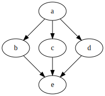
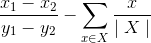

# Extended Markdown
Extend the capabilities of Markdown with diagrams and LaTeX.

### Work in Progress :wrench:

The goal of this project is to process **Extended Markdown** files (`.mdx`) into **Markdown** files (`.md`). This extension adds useful capabilities such as:
- [x] Graph diagrams
- [x] Block LaTeX rendering
- [x] Inline LaTex rendering (i.e. `$y = mx + b$ is a rational function!` )

### Examples

#### Graphs

#### Latex Equations

You can perform complex inline Latex:
- 
