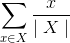

# Extended Markdown
Extend the capabilities of Markdown with diagrams and LaTeX.

### Work in Progress :wrench:

The goal of this project is to process **Extended Markdown** files (`.mdx`) into **Markdown** files (`.md`), by rending complex objects as images that can be conveniently displayed on services that can render traditional Markdown (ex. GitHub). This extension adds useful capabilities such as:
- [x] Graph diagrams
- [x] Block LaTeX rendering
- [x] Inline LaTex rendering (i.e. `y = mx + b is a rational function!` )

### Examples

#### Graphs

##### Source

```
-------
a -> b
a -> c
a -> d
b -> e
c -> e
d -> e
-------
```

##### Results


#### Latex Equations

##### Source

```
You can perform complex inline Latex:
- A fraction: $$\frac{x_1 - x_2}{y_1 - y_2}$$.
- You can use symbols such as: $$\sum_{x \in X} \frac{x}{\mid X \mid}$$
```

##### Results

You can perform complex inline Latex:
- A fraction: .
- You can use symbols such as: 
